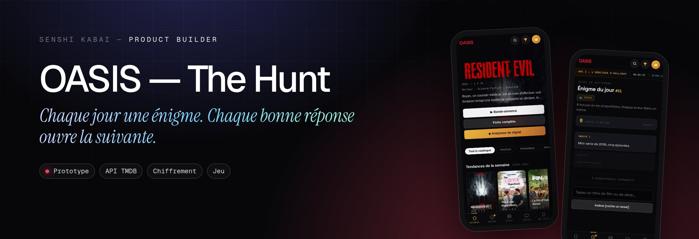
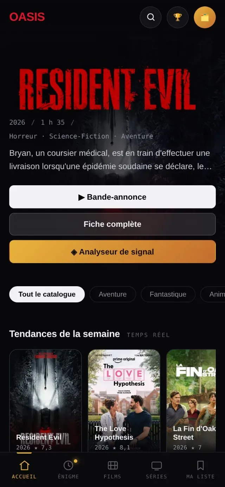
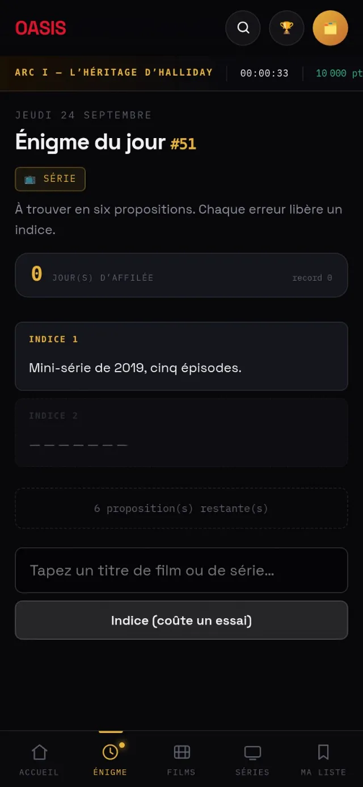

  
  

<h1 align="center">OASIS — The Hunt</h1>

<b>Chaque jour une énigme. Chaque bonne réponse ouvre la suivante.</b> Un catalogue de films et séries façon plateforme de streaming, doublé d'une chasse au trésor quotidienne inspirée de Ready Player One.

Statut : <b>Prototype</b>

> **Pensé pour le téléphone.** C'est une application web installable (PWA) : ouvrez la démo sur votre mobile pour la voir telle qu'elle a été conçue. Sur un ordinateur, l'affichage n'est pas celui prévu ; la [fiche du portfolio](https://www.senshicore.com/projets/oasis/) l'ouvre dans un cadre de téléphone, avec un QR code pour passer sur mobile.

---

### Le problème

Rendre la découverte de films et séries ludique, avec des énigmes impossibles à tricher en lisant le code de la page.

### L'idée

Une énigme par jour ; la bonne réponse sert de clé pour déverrouiller l'étape suivante.

### Comment c'est fait

Énigmes générées par script à partir de listes thématiques, chaque étape chiffrée avec une clé dérivée de la réponse. Catalogue alimenté par l'API TMDB.

**Outils** &nbsp; `API TMDB` `Chiffrement` `Jeu`

### Aperçu

 

### Mentions

Jeu inspiré de l'univers de *Ready Player One* (Ernest Cline), projet personnel **non affilié**. Données de films : TMDB. *This product uses the TMDB API but is not endorsed or certified by TMDB.*

### English

**OASIS — The Hunt** — *A riddle a day. Every right answer unlocks the next.* A streaming-style film and TV catalogue, paired with a daily treasure hunt inspired by Ready Player One.

Make discovering films and shows playful, with riddles you can't cheat by reading the page's code. One riddle a day; the right answer is the key that unlocks the next step. Riddles generated by script from themed lists, each step encrypted with a key derived from the answer. Catalogue powered by the TMDB API.

---

Conçu, développé et mis en ligne par <b>Senshi Kabai</b>, Product Builder · <a href="https://www.senshicore.com/">portfolio</a> · <a href="https://www.senshicore.com/projets/oasis/">fiche du projet</a> © 2026 Senshi Kabai — tous droits réservés.

